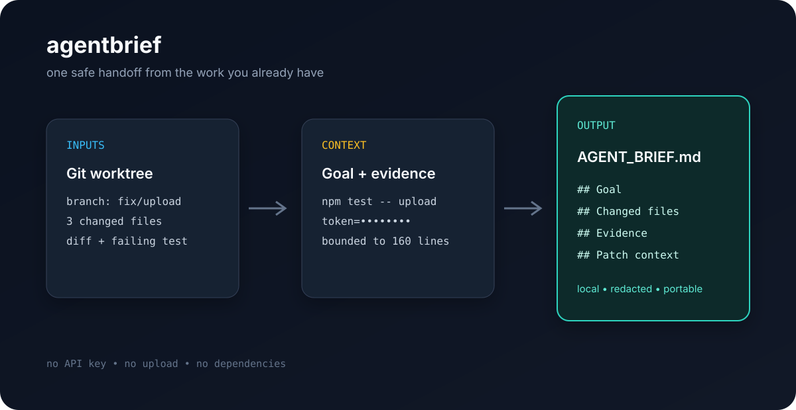

# agentbrief


Turn a messy Git worktree into a safe, portable handoff for the next coding agent.



```text
worktree + goal + failing log  →  AGENT_BRIEF.md
```

`agentbrief` captures the branch, changed files, diff context, reproduction command, and observed evidence. Token-shaped secrets are redacted before the file is written. It does not call an AI API, upload code, or require dependencies.

## Install

```bash
npx --yes github:jovial-liu/agentbrief#v1 --help
```

## Quick start

```bash
agentbrief \
  --goal "Fix the flaky upload test" \
  --command "npm test -- upload" \
  --out AGENT_BRIEF.md
```

Attach a failing run without saving the raw log first:

```bash
npm test 2>&1 | agentbrief --log - --goal "Make the test suite green"
```

The resulting Markdown is intentionally readable by a person and copy-pasteable into Codex, Claude Code, Cursor, Gemini CLI, or a plain issue/PR comment.

## Formats and safety

```bash
agentbrief --format json --out handoff.json
agentbrief --max-lines 80 --no-diff
agentbrief --no-redact # only for a private, trusted workspace
```

The default output is `AGENT_BRIEF.md`; use JSON when another tool needs a stable machine-readable envelope. Diffs and logs are capped so one noisy command cannot create an accidental context bomb. The brief contains no absolute local path.

## GitHub Action

```yaml
- uses: actions/checkout@v4
- uses: jovial-liu/agentbrief@v1
  with:
    goal: "Explain why the release job is failing"
    command: "npm run release:check"
    output: artifacts/AGENT_BRIEF.md
```

## Library API

```js
import { collectBrief, renderMarkdown } from 'agentbrief';

const brief = await collectBrief({
  goal: 'Fix the flaky upload test',
  command: 'npm test -- upload',
  log: 'paste a failing log here'
});
console.log(renderMarkdown(brief));
```

## Why this exists

The expensive part of handing a task to an agent is often not writing the prompt; it is reconstructing the current state. `agentbrief` makes that state explicit, bounded, and safe to share. It is deliberately boring infrastructure: one file, one artifact, one reproducible handoff.

## Development

```bash
npm test
npm run lint
```

MIT licensed. Contributions and examples are welcome.
